# SOLIN — Monitoramento de Saúde de Pets (Clyvo Vet)

> Java Advanced — FIAP — Challenge 2026, 2º Semestre — Sprint 3

##  Equipe — Turma 2TDSR

| Nome | RM |
|---|---|
| Natália Cristina | RM564099 |
| Nickolas Davi | RM564105 |
| Rodrigo Silva | RM565162 |
| Samara Vilela | RM566133 |
| Otávio Ferreira | RM565960 |

##  Vídeo de apresentação

`[link do YouTube aqui]`

---

O SOLIN nasceu como API REST nas Sprints 1 e 2 e virou aplicação web completa nesta Sprint 3, em **Spring Boot**. A ideia central não mudou: acompanhar a rotina diária de saúde de um pet (se urinou, se comeu, se bebeu água), seja o tutor registrando na mão ou um sensor IoT mandando os dados, e disparar um **alerta automático** quando algo sai do padrão esperado para aquela espécie. O que essa sprint trouxe de novo foi a tela em si — antes só existia a API — além de versionamento de banco com **Flyway** e login/permissões com **Spring Security**. O projeto é ambientado numa clínica fictícia, a **Clyvo Vet**.

---

##  Por que isso é um problema de verdade

Na prática, quase ninguém anota direito a rotina do próprio pet. E sem esse histórico, o veterinário só tem o relato de memória do tutor na hora da consulta — o que atrapalha bastante o diagnóstico de problemas urinários, renais ou comportamentais, principalmente em gatos, que são conhecidos por esconder sintomas até o quadro já estar avançado.

O SOLIN resolve isso registrando cada evento (urinou, comeu, bebeu água) com data e hora, e comparando automaticamente com o limite esperado para a espécie daquele pet. Quando o intervalo sem um evento passa do normal, o sistema já cria um alerta — **Amarelo** para atenção, **Vermelho** para algo mais sério — e a equipe da Clyvo Vet consegue agir antes de virar emergência, em vez de descobrir o problema só quando o tutor já está preocupado.

---

##  Arquitetura

```
Tutor (navegador) ──┐
                     ├──► Camada Web (Thymeleaf, MVC) ──► Service ──► Repository (JPA) ──► PostgreSQL
Veterinário (nav.) ──┘                                        │
                                                                └──► Strategy (regras de alerta)

App mobile / Sensor IoT (ESP32) ──► API REST (/api/**) ──► Service ──► Repository ──► PostgreSQL
```

A aplicação segue arquitetura em camadas: **Controller (Web/REST) → Service → Repository → Entity**, com DTOs separando a camada de transporte da de domínio, e o Flyway controlando todo o schema do banco.

### Design Patterns utilizados

| Padrão | Uso no projeto |
|---|---|
| **Repository** | Interfaces Spring Data JPA para acesso a dados |
| **DTO** | Records separando request, response e entidade |
| **Service** | Regras de negócio isoladas dos controllers |
| **Builder** | Construção das entidades JPA (via Lombok `@Builder`) |
| **Strategy** | Cada regra de alerta é uma classe que implementa `RegraAlertaStrategy`. Adicionar uma nova regra não exige alterar nenhum código existente |
| **MVC** | Controllers de tela (`web.tutor`, `web.vet`) separados dos controllers de API (`controller`), ambos reaproveitando a mesma camada de serviço |

---

##  Stack

- Java 17
- Spring Boot 3.2.5
- Spring Data JPA + Hibernate
- **Spring Security** (form login + Basic Auth para a API, BCrypt, 2 perfis de acesso)
- **Thymeleaf** (camada de visualização server-side) + `thymeleaf-extras-springsecurity6`
- **Flyway** (versionamento do schema do banco)
- **PostgreSQL 16**
- Bean Validation (Jakarta Validation)
- SpringDoc OpenAPI 3 (Swagger)
- Spring Cache (in-memory)
- Lombok
- Maven
- Docker / Docker Compose (para subir o banco localmente)

---

##  Perfis de acesso (Spring Security)

| Perfil | O que pode fazer |
|---|---|
| **TUTOR** | Acessa `/tutor/**`. Vê **apenas os próprios pets**, consulta a linha do tempo de eventos e **registra novos eventos de saúde** (fluxo 1). |
| **VETERINARIO** | Acessa `/vet/**`. Representa a equipe clínica da Clyvo Vet: vê o **painel consolidado de alertas de todos os pets** do sistema e **resolve alertas** após o atendimento (fluxo 2). |

As rotas são protegidas tanto por perfil (`hasRole`) na configuração de rotas quanto por `@PreAuthorize` no nível dos controllers (`@EnableMethodSecurity`). Um tutor autenticado não consegue acessar `/vet/**` (e vice-versa) — a tentativa é redirecionada para uma página de acesso negado.

---

##  Como rodar

### Pré-requisitos
- JDK 17+
- Maven 3.8+ (ou `./mvnw`, se presente)
- Docker e Docker Compose (para o PostgreSQL local)

### Passo a passo

**1. Suba o banco de dados PostgreSQL:**

```bash
docker compose up -d
```

Isso cria um container `solin-db` com PostgreSQL 16, banco `solindb`, usuário `solin` e senha `solin123` (porta `5432`).

**2. Rode a aplicação:**

```bash
mvn spring-boot:run
```

Na primeira subida, o **Flyway** executa automaticamente as migrations em `src/main/resources/db/migration/`, criando todas as tabelas e já populando dados de demonstração (espécies, tutores, pets, eventos e um alerta ativo).

A aplicação sobe na porta **8080** com context path **/solin**.
URL base: `http://localhost:8080/solin`

>  **Este projeto não roda em H2/localhost sem banco real** — é necessário o PostgreSQL do `docker compose up -d` (ou outro Postgres acessível, ajustando `DB_URL`/`DB_USER`/`DB_PASSWORD`).

**3. Acesse pelo navegador:**

`http://localhost:8080/solin/login`

### Acesso para avaliação (login pronto, sem precisar cadastrar nada)

Para quem for rodar o projeto e avaliar sem cadastrar conta própria, este é o login do veterinário — é o que dá acesso ao **painel completo da clínica** (todos os pets, todos os alertas):

```
Email: marcel.wagner@clyvovet.com.br
Senha: tranquilo123
```

Se por algum motivo essa conta não funcionar no banco de quem for testar, existe uma segunda conta de veterinário, mais genérica, criada só para isso (mesmo acesso, sem nome vinculado a um veterinário específico):

```
Email: vet.demo@clyvovet.com.br
Senha: demo123
```

Ambas aparecem também na própria tela de login, na aba **"Sou Veterinário"**, então dá pra copiar direto de lá também. As senhas não ficam em texto puro em lugar nenhum do banco — são guardadas com hash BCrypt na tabela `TB_USUARIO`; o texto puro acima é só para facilitar o login de quem for avaliar o projeto.

Já do lado do tutor, não existe "a" conta certa para entrar — **qualquer pessoa pode criar a própria conta** pela tela de login, clicando em **"Criar conta"** (rota pública `/cadastro`, sem precisar estar logado). É assim que testamos o sistema também: cada um de nós criou a própria conta de tutor, cadastrou os próprios pets e foi registrando eventos de verdade, sem senha fixa nenhuma. Se preferir não criar uma conta nova, também existe uma de demonstração:

| Perfil | Email | Senha |
|---|---|---|
| Tutor (demonstração) | `tutor.demo@solin.com` | `demo123` |

> Essas contas de demonstração (tutor e veterinário genérico) vêm da migration `V4__contas_demonstracao_genericas.sql`; a conta nomeada do veterinário (Dr. Marcel Wagner) e os tutores/pets de exemplo vêm da `V3__carga_inicial_dados.sql`. Nenhuma delas é obrigatória — são só atalhos para não precisar cadastrar nada na mão antes de dar uma olhada no sistema.

### Variáveis de ambiente (opcional)

Por padrão a aplicação já aponta para o banco do `docker-compose.yml`. Para usar outro PostgreSQL:

```bash
export DB_URL=jdbc:postgresql://localhost:5432/solindb
export DB_USER=solin
export DB_PASSWORD=solin123
mvn spring-boot:run
```

---

##  Flyway — controle de versão do banco

| Migration | Conteúdo |
|---|---|
| `V1__criacao_schema_inicial.sql` | Tabelas do domínio SOLIN: `TB_ESPECIE`, `TB_TUTOR`, `TB_PET`, `TB_EVENTO`, `TB_ALERTA` (com FKs, índices e comentários) |
| `V2__seguranca_usuarios.sql` | Tabela `TB_USUARIO` (Spring Security), com vínculo opcional a `TB_TUTOR` e checagens de perfil |
| `V3__carga_inicial_dados.sql` | Dados de demonstração: espécies, tutores, usuários de teste (senhas com hash BCrypt), pets, eventos e um alerta já disparado |
| `V4__contas_demonstracao_genericas.sql` | Duas contas de demonstração genéricas (uma Tutor, uma Veterinário) exibidas na tela de login |
| `V5__mais_especies.sql` | Renomeia "Cao" para "Cachorro" e adiciona 6 novas espécies (Hamster, Papagaio, Peixe, Tartaruga, Porquinho-da-índia, Calopsita), cada uma com seu próprio limite de horas sem urinar |
| `V6__limite_horas_sem_agua.sql` | Novo campo `QT_HORAS_MAX_AGUA` em `TB_ESPECIE`, usado pela segunda regra de alerta (hidratação) |
| `V7__soft_delete_pet.sql` | Novo campo `ST_ATIVO` em `TB_PET` (soft delete: desativar um pet preserva o histórico em vez de apagar) |

O Hibernate está configurado com `ddl-auto=validate` — ou seja, **é o Flyway quem cria e evolui o schema**; o Hibernate só confere se as entidades batem com as tabelas já criadas. Qualquer alteração futura de schema deve entrar como uma nova migration (`V4__...sql`), nunca editando as anteriores.

---

##  Fluxos completos da aplicação (frontend)

Todo o uso do sistema — cadastrar, registrar e atualizar — acontece **dentro do próprio site**, em telas normais de formulário. Não é necessário usar o Swagger para nada disso; ele existe só como documentação técnica extra da API REST (ver seção abaixo), não como parte do fluxo do produto.

### Fluxo 1 — Criação de conta (auto-cadastro público de tutor)

1. Na tela de login, qualquer pessoa clica em **"Criar conta"** (rota pública `/cadastro`, não exige login).
2. Informa nome, telefone, email e senha (com confirmação).
3. Ao salvar, o `CadastroService` cria, numa única transação, o registro de contato (`TB_TUTOR`) **e** o registro de login (`TB_USUARIO`, perfil `TUTOR`, senha já em hash BCrypt) vinculados entre si.
4. A pessoa é redirecionada para o login e já pode entrar com o email e a senha que acabou de criar. Essa conta é permanente: o email cadastrado aqui é o login definitivo do tutor no SOLIN.

### Fluxo 2 — Tutor cadastra um novo pet

1. Na área do tutor, clica em **"Cadastrar pet"**.
2. Informa nome, espécie, raça (opcional), idade aproximada em anos (opcional — muitos tutores não sabem a idade exata do animal) e peso (obrigatório).
3. Ao salvar, o pet passa a ser monitorado automaticamente pelas regras de alerta do SOLIN.

A tela inicial **"Meus pets"** também traz um pequeno painel-resumo no topo (total de pets monitorados, quantos têm alerta ativo agora, e a data/hora do último evento registrado entre todos os pets), calculado a partir dos mesmos dados já usados nos cards — sem nenhuma consulta nova ao banco.

**Desativar um pet (soft delete):** cada card de pet tem um botão "Desativar pet". Diferente de um DELETE, isso não remove nada do banco — só marca `ST_ATIVO = false`, e o pet some das listagens do dia a dia (tanto do tutor quanto do veterinário), preservando todo o histórico de eventos e alertas para auditoria futura. A checagem de propriedade garante que um tutor só consegue desativar os próprios pets.

### Fluxo 3 — Tutor registra evento de saúde → alerta automático

1. O tutor faz login e cai em **"Meus pets"**, com o status atual de cada pet (normal / atenção / crítico).
2. Clica em **"Registrar evento"**, escolhe o pet, o tipo de evento (urinou, comeu, bebeu água, etc.), a origem (manual ou sensor IoT) e a data/hora.
3. Ao salvar, o `EventoService` grava o evento e **imediatamente** manda o `AlertaService` reavaliar as regras (`Strategy`) daquele pet.
4. Se algum limite for ultrapassado, um novo alerta é criado na hora e o tutor recebe um aviso visual na tela seguinte.

### Fluxo 4 — Veterinário avalia e resolve alertas

1. O veterinário (perfil `VETERINARIO`) faz login e cai direto no **Painel de alertas**, com todos os pets da clínica, ordenados por gravidade (crítico primeiro).
2. Pode filtrar por pendentes / resolvidos / todos.
3. Ao atender o caso (por telefone, presencialmente etc.), clica em **"Marcar resolvido"** — o alerta sai da lista de pendências e fica registrado como resolvido.

Todos os fluxos têm **validação de formulário** (Bean Validation nos DTOs/records + forms com mensagens de erro exibidas diretamente nos campos) e checagem de propriedade dos dados (um tutor nunca consegue registrar evento ou editar dados de outro tutor, mesmo manipulando a URL).

### Extra — Assistente SOLIN (chat de orientação baseado em regras)

Na área do tutor, o menu **"Assistente SOLIN"** abre um chat onde o tutor escolhe entre perguntas prontas ("Como está a saúde do pet hoje?", "Meu pet está com alerta, o que eu faço?", etc.) e recebe uma resposta gerada na hora com base nos dados reais do pet selecionado (alertas ativos e eventos recentes).

**Importante: isso não é uma integração com IA generativa (ChatGPT, Gemini, etc.)** — é uma decisão deliberada de projeto. As respostas são geradas por regras de negócio no `AssistenteService`, reaproveitando exatamente os mesmos dados que já alimentam o motor de alertas (Strategy). A tela deixa isso explícito para o usuário logo no topo do chat. As vantagens dessa escolha:

- Zero dependência de serviço externo ou chave de API (nada quebra por falta de internet ou limite de uso de uma API de terceiros)
- Comportamento 100% previsível e determinístico — a mesma pergunta, com os mesmos dados, sempre gera a mesma resposta
- Todo o "raciocínio" é código Java aberto e explicável linha a linha, ao contrário de uma IA generativa de terceiros

O front-end chama o back-end via `fetch` (POST em `/tutor/assistente/perguntar`, JSON), com o token CSRF (exigido pelo Spring Security em toda rota MVC) enviado via header, lido de uma meta tag no `<head>` da página.

---

##  Documentação Swagger (API REST original)

A API REST das Sprints anteriores continua disponível (usada por app mobile / sensor IoT) e agora também exige autenticação (Basic Auth). Ela é apenas **documentação técnica opcional** dos endpoints — todo o uso funcional do sistema descrito acima já acontece direto pelo site, sem precisar dela:

- **UI:** http://localhost:8080/solin/swagger-ui.html
- **JSON:** http://localhost:8080/solin/v3/api-docs

---

##  Evidências de funcionamento

Prints reais de um teste completo do sistema rodando local, cobrindo os dois perfis (tutor e veterinário) de ponta a ponta — do banco de dados subindo até um alerta crítico sendo resolvido pela clínica. Todos os arquivos ficam na pasta `docs/`.

**1. Banco de dados e migrations**

Console do IntelliJ com a aplicação subindo e as 7 migrations do Flyway aplicadas com sucesso:

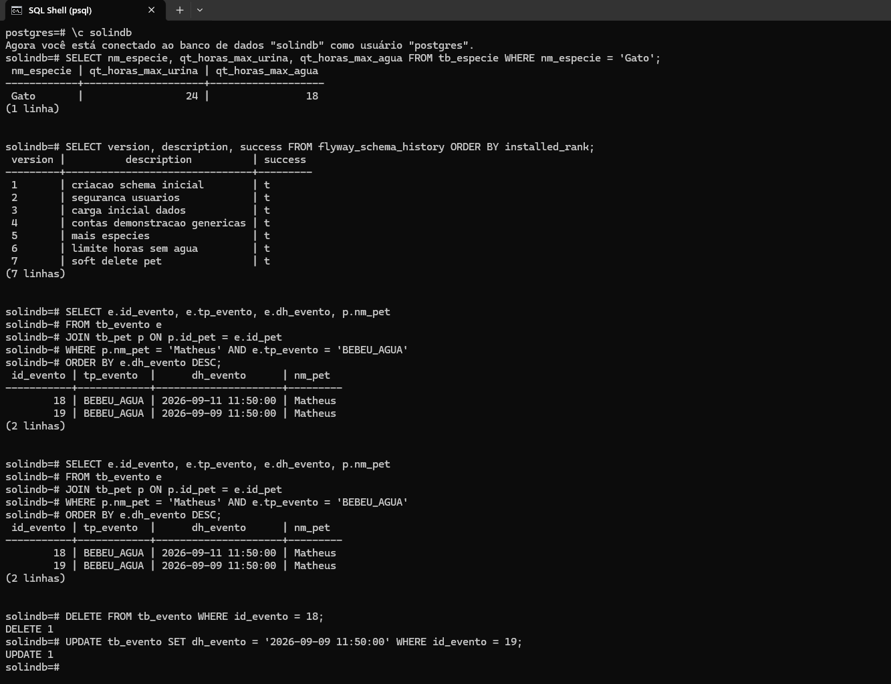

Conexão com o banco `solindb` via psql:

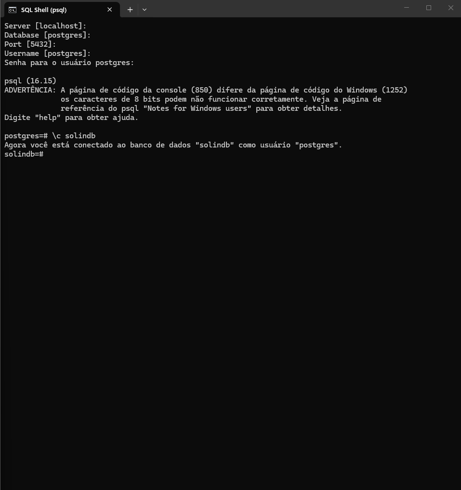

Durante os testes, usamos o próprio psql para simular cenários (apagar um evento duplicado que estava mascarando o alerta) e conferir que o motor de alertas está reagindo certo aos dados — não é só "aparecer bonito na tela", o alerta reflete o que está de fato salvo no banco:

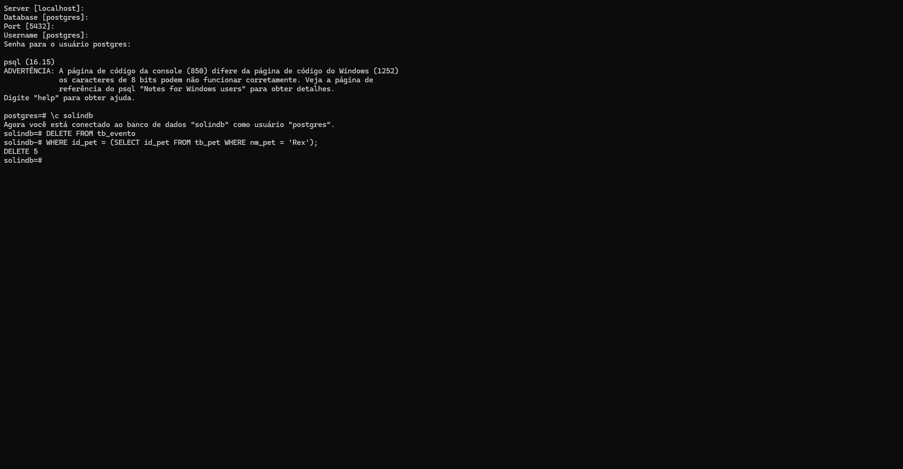

**2. Criação de conta e login**

Tela de criação de conta — qualquer pessoa pode se cadastrar como tutor por aqui, sem precisar de nenhuma senha fixa:

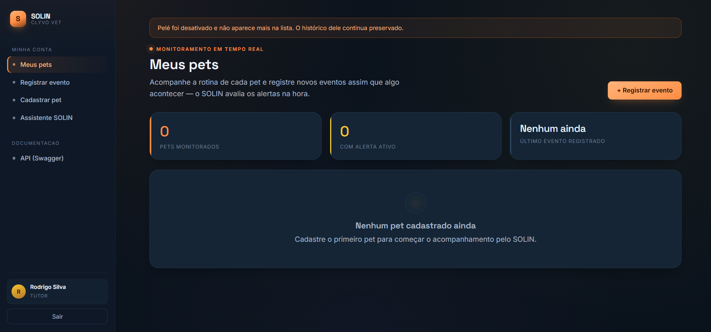

Tela de login com o fundo autoral (foto do pet):

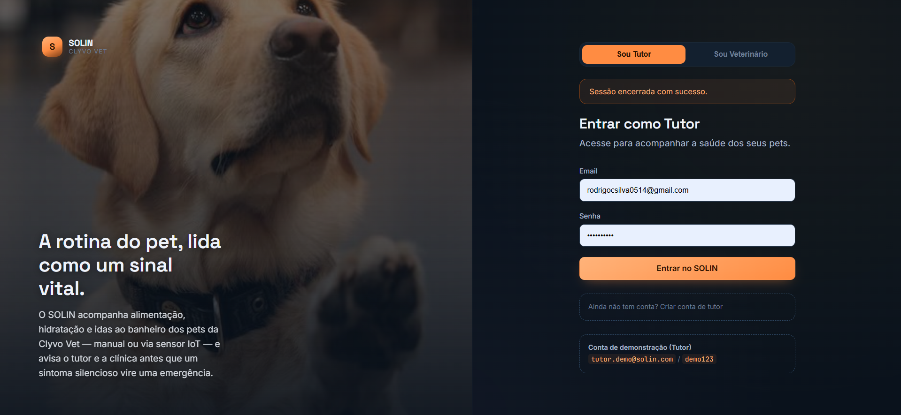

**3. Área do tutor — cadastro de pet**

Formulário de cadastro de um novo pet, com a espécie selecionada:

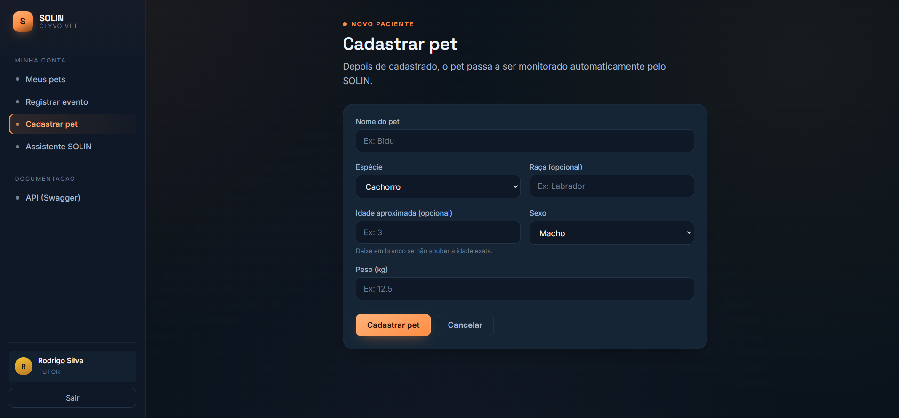

**4. Área do tutor — painel "Meus pets"**

Painel-resumo no topo (total de pets, alertas ativos, último evento registrado) e os cards dos pets cadastrados:

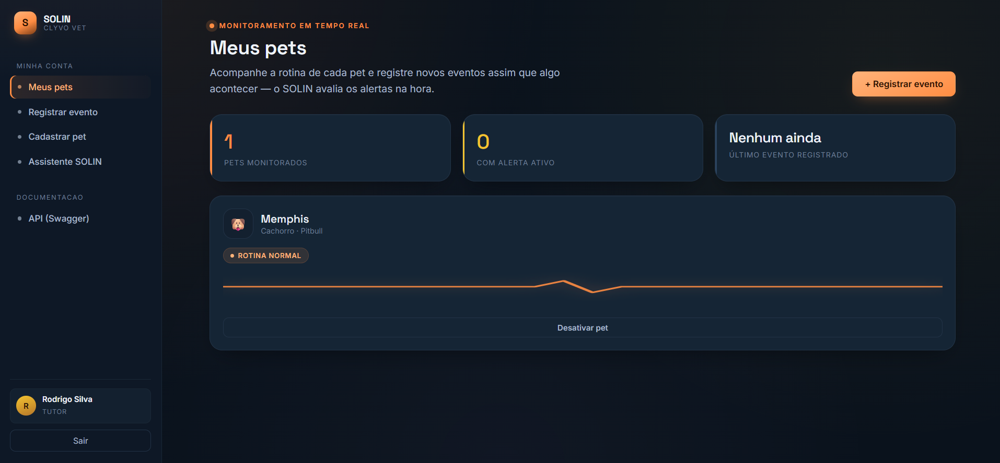

**5. Registro de evento de saúde**

Formulário de registro de evento preenchido pelo tutor:

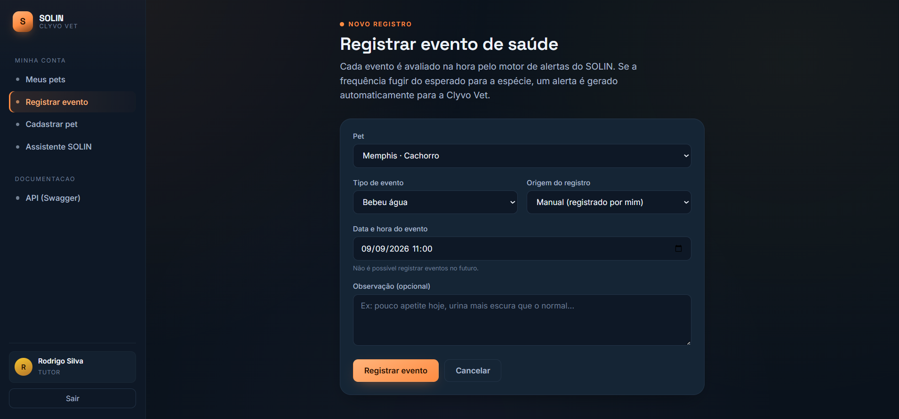

Ficha do pet já com o alerta **vermelho** disparado na timeline:

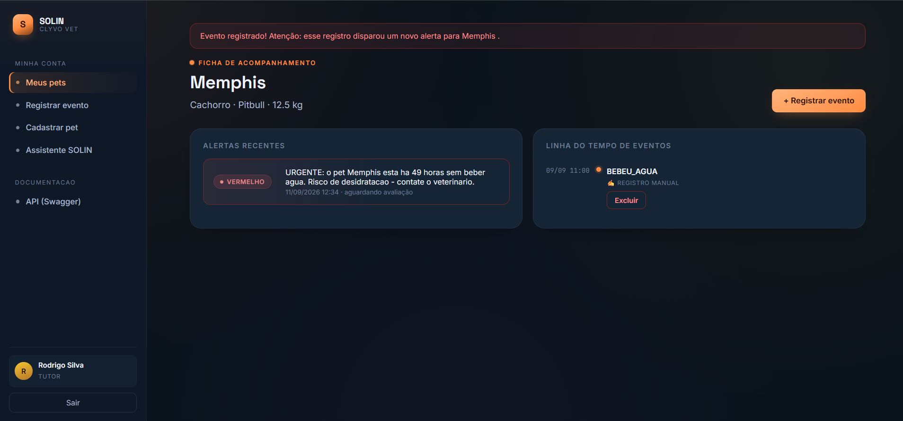

O tutor também pode excluir um evento registrado errado direto pela própria timeline:

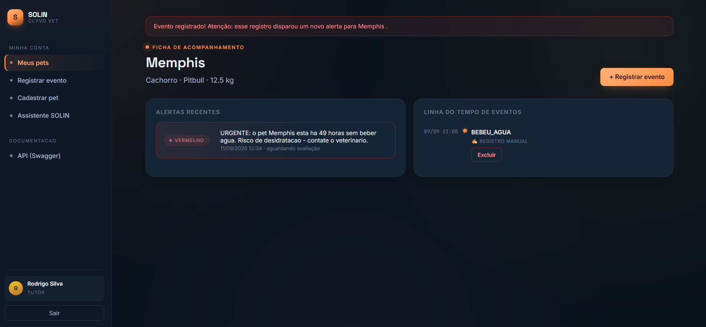

**6. Assistente SOLIN (chat baseado em regras)**

Conversa com o assistente, respondendo sobre o alerta ativo e os últimos eventos do pet a partir dos dados reais cadastrados:

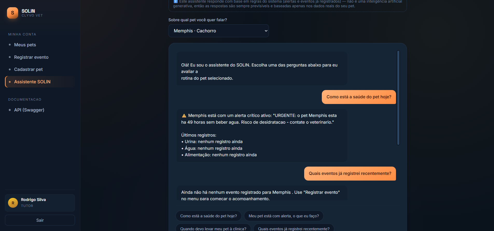

**7. Painel do veterinário**

Alerta crítico (vermelho) pendente, aguardando avaliação da clínica:

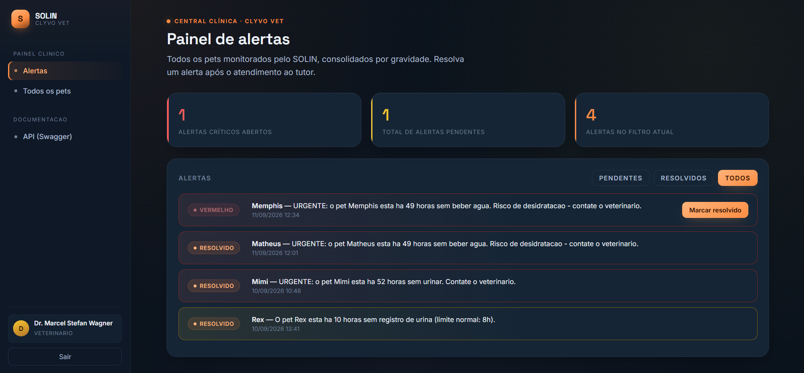

Mesmo alerta, já marcado como resolvido depois do atendimento:

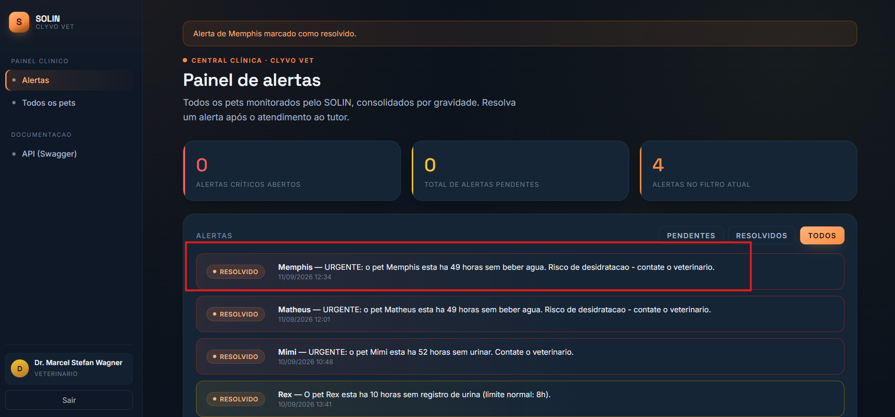

**8. Painel do veterinário — todos os pets da clínica**

Listagem consolidada com os pets de diferentes tutores, visível só pelo perfil veterinário:

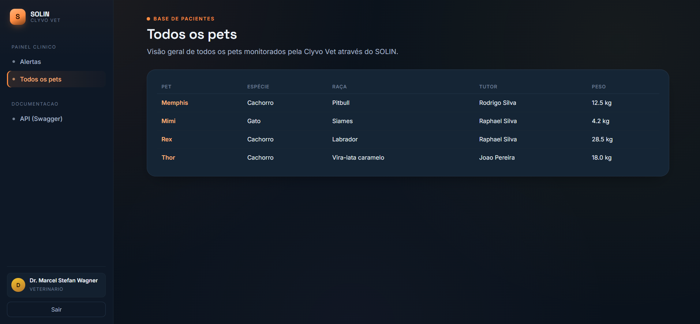

---

##  Regras de alerta (Strategy Pattern)

Cada espécie tem dois limites configurados em `TB_ESPECIE`: `horasMaximasSemUrinar` (Cachorro = 8h, Gato = 24h, Coelho = 12h, ...) e `horasMaximasSemBeberAgua` (Cachorro = 12h, Gato = 18h, Coelho = 10h, ...).

| Regra | Quando dispara |
|---|---|
| `RegraSemUrinarAmarelo` | Entre `limite` e `2x limite` horas sem registro de urina |
| `RegraSemUrinarVermelho` | A partir de `2x limite` horas sem urinar |
| `RegraSemBeberAguaAmarelo` | Entre `limite` e `2x limite` horas sem registro de "bebeu água" |
| `RegraSemBeberAguaVermelho` | A partir de `2x limite` horas sem beber água (risco de desidratação) |

As duas últimas foram adicionadas depois das duas primeiras, sem alterar uma linha sequer do `AlertaService` ou das regras de urina — é exatamente a vantagem do Strategy: o Spring injeta `List<RegraAlertaStrategy>` automaticamente, então bastou criar as duas novas classes `@Component` implementando a interface.

> **Como adicionar uma nova regra:** crie uma classe `@Component` que implemente `RegraAlertaStrategy`. O Spring injeta automaticamente no `AlertaService`. Nenhum código existente precisa ser alterado (Open/Closed Principle).

---

##  Requisitos atendidos (Sprint 3 — Java Advanced)

- [x] **Frontend**: Thymeleaf server-side, layout responsivo autoral (conceito "monitor de sinais vitais"), telas de login, criação de conta, área do tutor (pets, cadastro de pet, registro de evento) e painel do veterinário
- [x] **Flyway**: 7 migrations versionadas, schema completo + seed de dados + evoluções incrementais (novas espécies, novos campos, soft delete)
- [x] **Spring Security**: 2 perfis (`TUTOR`, `VETERINARIO`) com permissões diferentes, proteção de rotas por perfil (`hasRole` + `@PreAuthorize`), senhas com hash BCrypt
- [x] **4 fluxos completos** (além de CRUD): criação de conta (auto-cadastro de tutor); cadastrar pet; registrar evento → alerta automático; e resolução de alertas pelo veterinário
- [x] **Validações** nos formulários (Bean Validation) e nos dados (regras de negócio nos services)
- [x] Entidades JPA com relacionamentos, API REST RESTful, Design Patterns (Repository, DTO, Service, Builder, Strategy), paginação, cache, tratamento global de exceções (API e Web)
- [x] **Extras além do mínimo pedido**: segunda regra de alerta via Strategy (hidratação, além da urina), soft delete de pet (preserva histórico), painel-resumo na tela inicial do tutor, exclusão de evento pela própria interface (tutor e veterinário), Assistente SOLIN (chat de orientação baseado em regras de negócio, sem depender de IA generativa externa)

---

##  Estrutura do projeto

```
src/main/java/br/com/fiap/solin/
├── config/         → OpenAPI
├── controller/     → 5 controllers REST (API, consumida por app mobile/IoT)
├── web/            → Controllers MVC (telas): tutor/, vet/, páginas públicas
├── security/       → Spring Security: UserDetailsService, SecurityConfig, helper de usuário logado
├── dto/            → request/ e response/ (Bean Validation)
├── entity/         → Entidades JPA (Tutor, Pet, Especie, Evento, Alerta, Usuario)
├── enums/          → TipoEvento, NivelAlerta, Perfil, etc.
├── exception/      → Handlers globais (API em JSON, telas em HTML)
├── mapper/         → Conversão entity ↔ DTO
├── repository/     → Spring Data JPA
├── service/        → Regras de negócio
└── strategy/       → Regras de alerta (Strategy Pattern)

src/main/resources/
├── db/migration/   → Scripts Flyway (V1 a V7)
├── templates/      → Telas Thymeleaf (login, tutor/, vet/, fragments/)
└── static/css/     → Design system autoral (solin.css)

docs/               → Prints/evidências de funcionamento (ver seção "Evidências" acima)
```

---

##  Equipe

Repositório GitHub: https://github.com/Rcsilva05/solin---java---chalenge

Turma: **2TDSR** — FIAP — 2026
